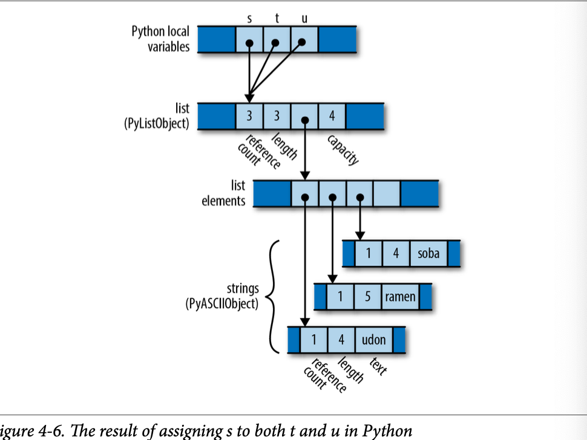
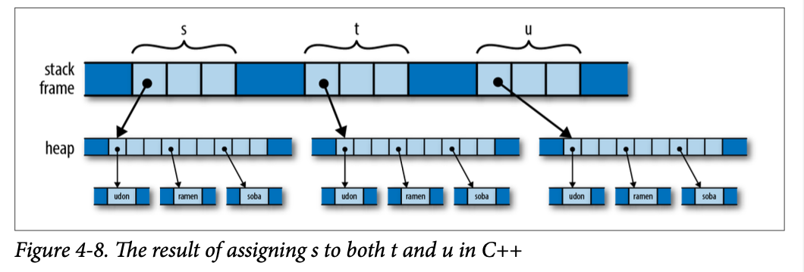

# Ownership
Rust做出了以下兩個承諾，這兩個承諾對安全的系統程式設計語言都至關重要：

- 您可以决定程式中每個值的使用壽命。 Rust在您的控制下迅速釋放屬於某個值的記憶體和其他資源。
- 即便如此，在對象被釋放後，您的程式將永遠不會使用指向對象的指針。 在C和C++中，使用懸空指針是一個常見的錯誤：如果你運氣好，你的程式就會崩潰。 如果你運氣不好，你的程式有一個安全性漏洞。 Rust在編譯時發現了這些錯誤。

許多語言都使用垃圾收集來實現第二個承諾，只有當指向對象的所有可訪問指針都消失時，才會自動釋放對象。 但作為交換，您可以將對象何時釋放的控制權交給收集器。 總的來說，垃圾收集器是令人驚訝的野獸，理解為什麼記憶體沒有被釋放
你期望的可能是一個挑戰。 如果你使用的對象代表了發送的檔案、網絡連接或其他作業系統資源，那麼不能相信它們會在你想要的時間被釋放，並且它們的底層資源也會隨之被清理，這是令人失望的。


但這些限制的最終效果是給混亂帶來足够的秩序，允許Rust的編譯時檢查來驗證你的程式是否沒有記憶體安全錯誤：懸掛指針、雙重釋放、使用未初始化的記憶體等等。在運行時，你的指針是記憶體中的簡單地址，就像在C和C++中一樣。 不同之處在於，您的程式碼已經被證明可以安全地使用它們。


這些相同的規則也構成了Rust支持安全併發程式的基礎。 使用Rust精心設計的線程原語，確保程式碼正確使用記憶體的規則也可以證明它沒有數據競爭。 Rust程式中的錯誤不會導致一個線程破壞另一個線程的數據，從而在系統的不相關部分引入難以複製的故障。 多執行緒程式碼中固有的不確定性行為與為處理它而設計的功能（互斥、消息通道、原子值等）隔離，而不是出現在普通記憶體引用中。 C和C++中的多執行緒程式碼贏得了醜陋的聲譽，但Rust很好地修復了它。


## Owenship

以c++語言舉例

```c++
std::string s = "frayed knot";
```

1. std::string对象本身始终只占用三个字（word）的空间，包括指向堆分配缓冲区的指针、缓冲区的总容量（即文本在必须分配更大缓冲区来容纳之前可以增长的大小）以及当前持有的文本的长度。这些字段是std::string类的私有字段，无法由字符串的用户直接访问。
2. std::string对象拥有其缓冲区：当程序销毁该字符串时，字符串的析构函数会释放缓冲区。过去，一些C++库在多个std::string值之间共享一个缓冲区，使用引用计数来决定何时释放缓冲区。但是，较新版本的C++规范实际上禁止了这种表示方式；现代的C++库都采用了本文所示的方法。在这种情况下，通常认为，虽然其他代码可以创建指向所拥有内存的临时指针，但是在所有者决定销毁所拥有的对象之前，该代码有责任确保其指针已经消失。你可以创建指向std::string缓冲区中的字符的指针，但是当字符串被销毁时，你的指针将变为无效，你需要确保不再使用它。所有者决定了所拥有对象的生命周期，其他所有代码都必须尊重其决策。

Rust將這一原則從注釋中删除，並在語言中明確表示。 在Rust中，每個值都有一個决定其生存期的所有者。 當所有者被釋放時——在Rust術語中被丟棄——所擁有的值也會被丟棄。 這些規則的目的是讓您只需檢查程式碼就可以輕鬆地找到任何給定值的生存期，從而控制系統語言應該提供的生存期。
變數擁有其值。 當控制項離開聲明變數的塊時，變數會被丟棄，囙此其值也會隨之被丟棄。例如：

```rust

fn print_padovan() {
	let mut padovan = vec![1,1,1]; // allocated here foriin3..10
  {
}
let next = padovan[i-3] + padovan[i-2];
    padovan.push(next);
}
println!("P(1..10) = {:?}", padovan);
// dropped here

```


變量類型`std::vec::Vec<i32>` 是32位向量組合，和c++中的`std::string`類似，

> 說的是堆棧的東西，看暈了


Rust程式通常根本不會顯式地删除值，就像C和C++程式使用free和delete一樣。 在Rust中删除值的方法是以某種管道將其從所有權樹中删除：通過離開變數的範圍，或從向量中删除元素，或諸如此類的管道。在這一點上，Rust確保正確地删除值及其所擁有的一切。


## Moves

在Rust中，對於大多數類型，將值分配給變數、將其傳遞給函數或從函數返回等操作<u>不會複製值：它們會移動值</u>。源將值的所有權交給目標，並變得不熟悉； 目的地現在控制值的生存期。 Rust程式構建和拆除複雜的結構——一次一個值，一次一次移動。


您可能會驚訝於Rust會改變這些基本操作的含義； 當然，在歷史的這一點上，這項任務應該非常明確。 然而，如果你仔細觀察不同的語言是如何選擇處理工作的，你會發現不同的學校實際上有很大的差异。 這種比較也使Rust選擇的意義和後果更容易理解。

#### **以python代碼為例**

```python
s = [ 'udon','ramen','soob']
t = s 
u = s
```

每個Python對象都有一個引用計數，跟踪當前引用它的值的數量。囙此，在賦值給s之後，程式的狀態如圖4-5所示（注意，有些欄位被省略了）。


由於只有s指向該清單，囙此該清單的引用計數為1； 並且由於清單是唯一指向字串的對象，所以它們的每個引用計數也是1。


當程式執行對t和u的賦值時會發生什麼？ Python只需使目標指向與源相同的對象，並新增對象的引用計數即可實現賦值。 囙此，程式的最終狀態如圖4-6所示。




**Python已經將指針從s複製到t和u中，並將清單的引用計數更新為3**。 Python中的賦值很便宜，但因為它創建了對對象的新引用，所以我們必須維護引用計數，以知道何時可以釋放值。

#### 現在考慮類似的C++程式碼

```c++
using namespace std;
vector <string>  s = {"udon","ramen","soba"};
vector <string>  t = s ;
vector <string>  u = s ;


```

當程式將s分配給t和u時會發生什麼？ 分配一個std::vector會在C++中生成該向量的副本； std::string的行為類似。 囙此，當程式到達該程式碼的末尾時，它實際上已經分配了三個向量和九個字串（圖4-8）。



根據所涉及的值，C++中的賦值可能會消耗無限量的記憶體和處理器時間。 然而，優點是程式很容易决定何時釋放所有記憶體：當變數超出範圍時，這裡分配的所有內容都會自動清理。


從某種意義上說，C++和Python選擇了相反的權衡：Python以需要引用計數（以及在一般情况下的垃圾收集）為代價，使賦值變得便宜。 C++保持所有記憶體的所有權是透明的，代價是讓賦值執行對象的深度複製。 C++程式師通常對這種選擇不太感興趣：深度複製可能很昂貴，而且通常有更實用的替代方案。

#### Rust裡面的處理

```rust
let s = vec!["udon".to_string(),"ream".to_string(),"soba".to_string()];
let t = s;
let u = s;

```

與C和C++一樣，Rust將“udon”等純字串文字放在只讀記憶體中，囙此為了與C++和Python示例進行更清晰的比較，我們在這裡調用to_string來獲取堆分配的字串值。


 初始化使t=s； 將向量的三個頭欄位從s移動到t； 現在t擁有向量。 向量的元素保持不變，字串也沒有發生任何變化。 每個價值觀仍然有一個單一的所有者，儘管其中一個已經易手。 沒有要調整的引用計數。 編譯器現在認為s未初始化。


那麼，當我們到達初始化時會發生什麼呢；？ 這會將未初始化的值s分配給u。Rust謹慎地禁止使用未初始化的數值，囙此編譯器會拒絕此程式碼，並出現以下錯誤：

```
error[E0382]: use of moved value: `s`
     --> ownership_double_move.rs:9:9
| 8 | | 9 | | |
let t = s;
    - value moved here
let u = s;
    ^ value used here after move
```


想想Rust在這裡使用移動的後果。 與Python一樣，賦值也很便宜：程式只需將向量的三個單詞的頭從一個位置移動到另一個位置。 但與C++一樣，所有權總是明確的：程式不需要引用計數或垃圾收集就可以知道何時釋放向量元素和字串內容。
你所付出的代價是，當你想要副本時，你必須明確要求。 如果您希望最終處於與C++程式相同的狀態，並且每個變數都持有結構的獨立副本，則必須調用向量的尅隆方法，該方法將執行向量及其元素的深度複製：

```
let s = vec!["udon".to_string(),"ream".to_string(),"soba".to_string()];
let t = s.clone();
let u = s.clone();
```


### More Operation that move 

在迄今為止的示例中，我們已經展示了初始化，在let語句中變數進入作用域時為其提供值。 為變數賦值略有不同，因為如果將值移動到已初始化的變數中，Rust會删除該變數的先前值。 例如

```rust
let mut s = "Govinda".to_string();
s = "Siddhartha".to_string(); // "Govinda" drop here 

```

在這段程式碼中，當程式將字串“Siddhartha”分配給s時，其先前的值“Govinda”將首先被删除。 但請考慮以下內容：


## Copy Types

## Rc and Arc
s