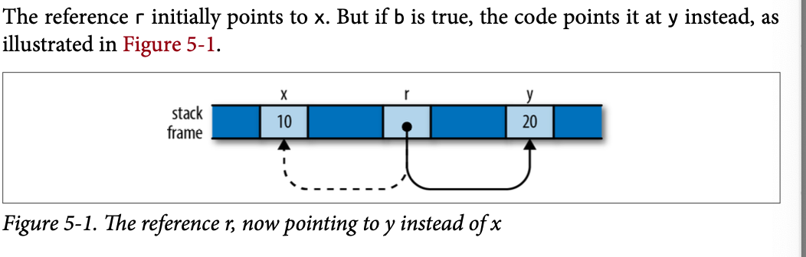

# References

到目前為止，我們看到的所有指針類型——簡單的Box<T>堆指針，以及String和Vec值內部的指針——都是擁有指針的：當所有者被丟棄時，引用也會隨之而去。Rust還有稱為引用的非擁有指針類型，這對其引用的生存期沒有影響。

事實上，情况恰恰相反：引用永遠不能超過其引用。 您必須在程式碼中明確表示，任何引用都不可能超過它所指向的值。為了強調這一點，Rust指的是創建一個對某個值的引用作為對該值的借用：您借用的東西，最終必須歸還給它的所有者。

如果你在閱讀“你必須在程式碼中應用它”這句話時感到懷疑，那麼你就是一個優秀的夥伴。 參考資料本身並沒有什麼特別之處——在引擎蓋下，它們只是地址。 但對Rust來說，保證他們安全的規則是新穎的； 除了研究語言，你以前不會見過這樣的語言。 儘管這些規則是Rust最需要努力掌握的部分，但它們所防止的經典的、絕對日常的bug的廣度是驚人的，它們對多執行緒程式設計的影響是解放的。 這又是魯斯特的激進賭注。

舉個例子，讓我們假設我們要建立一個文藝復興時期殺人藝術家和他們以作品聞名的表格。 Rust的標準庫包括一個雜湊表類型，囙此我們可以這樣定義我們的類型：

> demo.rs


但如果你已經閱讀了上一章關於動作的部分，這個表演的定義應該會提出一些問題。 特別是，HashMap不是Copy——它不可能是，因為它擁有一個動態分配的錶。 囙此，當程式調用show（table）時，整個結構被移到函數中，變數錶未初始化。 如果調用程式碼現在嘗試使用錶，它將遇到問題：

```
show(table);
assert_eq!(table["Gesuladp"][0],"many madrigals");
```

遇到報錯

```
error[E0382]: use of moved value: `table`
      --> references_show_moves_table.rs:29:16
| 28 | | 29 | | |
show(table);
     ----- value moved here
assert_eq!(table["Gesualdo"][0], "many madrigals");
           ^^^^^ value used here after move
       = note: move occurs because `table` has type `HashMap<String, Vec<String>>`,
               which does not implement the `Copy` trait
```

事實上，如果我們研究show的定義，外部for迴圈獲得雜湊表的所有權並完全消耗它； 內部for迴圈對每個向量都做同樣的操作。 （我們早些時候在“liberté，égalité，fraternité”考試中看到了這種行為。）由於移動語義的原因，<u>我們試圖將其列印出來，從而完全破壞了整個結構類比。</u> 


正確的處理方法是使用引用。 引用允許您在不影響其所有權的情况下訪問值。 references come in two kinds:

- 共享引用允許您讀取但不能修改其引用。 但是，您可以一次擁有任意多個對特定值的共享引用。 <u>運算式&e生成對e值的共享引用； 如果e的類型是T，那麼&e的類型為&T，</u>發音為“ref T”。 共享引用是Copy。
- 如果您有一個對值的可變引用，您可以讀取和修改該值。 但是，您可能不會同時啟動對該值的任何其他引用。 運算式<u>&mut e生成對e值的可變引用； 您將其類型寫成&mut T，發音為“ref mute T”</u>。 可變引用不是Copy。


> 簡單記憶就是，& 指代的就是引用，添加mut 就可以對引用的內容進行更改


當我們以將值的<u>所有權轉移到函數的管道將值傳遞給函數時，我們就說我們是按值傳遞的。</u> 如果我們將函數作為對該值的引用，則表示我們通過引用傳遞了該值。 例如，我們修復了<u>show函數，將其更改為通過引用而不是通過值接受</u>錶。 許多語言都有這種區別，但它在Rust中尤為重要，因為它闡明了所有權是如何受到影響的。


## References as Values

前面的例子展示了引用的一個非常典型的用法：允許函數訪問或操作結構而不獲取所有權。 但`references`	比這更靈活，所以讓我們看看一些例子，以更詳細地瞭解正在發生的事情。

### Rust References Versus C++ References 

如果您熟悉C++中的引用，那麼它們確實與Rust引用有一些共同之處。 最重要的是，它們都只是機器級別的地址。 但在實踐中，Rust的參考文獻有一種非常不同的感覺。
在C++中，引用是通過轉換隱式創建的，也隱式取消引用：

> versus.rs


### Assigning References

指定給Rust引用會使其指向一個新值：

```rust
let x= 10;
let y = 20;
let mut r = &x;
if b{ r=&y;}
assert!(*r==10 || *r ==20);
```



這與C++非常不同，在C++中，賦值給引用會將值存儲在其引用中。 <u>沒有辦法將C++引用指向初始化時使用的位置之外的其他位置。</u>


### References to References

Rust permits references to references:

```rust
struct Point {x:i32,y:i32}
let point = Point{x:1000,y:729};
let r : &Ppomt = &point;
let rr: &&Point = &r;
let rrr: &&&Point = &rr;

assert_eq!(rrr.y,729);
```


（為了清晰起見，我們已經寫出了參考類型，但您可以省略它們；這裡沒有Rust無法自行推斷的內容。）。 運算符會根據查找目標所需的引用數進行查找：


### Comparing References

喜歡。 運算子，Rust的比較運算子“看穿”任意數量的引用，只要兩個操作數具有相同的類型：

```
letx=10; lety=10;
letrx=&x; letry=&y;
let rrx = &rx; let rry = &ry;
    assert!(rrx <= rry);
    assert!(rrx == rry);
```

這裡的最終斷言是成功的，即使rrx和rry指向不同的值（即rx和ry），因為==運算子跟隨所有引用並對它們的最終目標x和y執行比較。這幾乎總是您想要的行為，尤其是在編寫泛型函數時。 如果你真的想知道兩個引用是否指向同一個記憶體，你可以使用std::ptr::eq，它將它們作為地址進行比較：

```
assert!(rx==ry);
assert!(!std::ptr::eq(rx,ry));
```


### References Are Never Null

Rust引用從不為空。 沒有類似於C的NULL或C++的nullptr； 引用沒有默認的初始值（無論其類型如何，在初始化之前都不能使用任何變數）； Rust不會將整數轉換為引用（不安全程式碼之外），囙此您無法將零轉換為引用。


Rust沒有空指針


### Borrowing References to Arbitrary Expressions

> 借用對任意運算式的引用


儘管C和C++只允許您將&運算子應用於某些類型的運算式，但Rust允許您借用對任何類型運算式值的引用：

```rust
fn factorial(n:usize)->usize{
(1..n+1).fold(1,|a,b|a*b)
}
let r = &factorial(6);
assert_eq!(r+&1009,1729);
```

在這種情況下，Rust只需創建一個匿名變數來保存運算式的值，並對此進行引用。 此匿名變數的生存期取決於您對引用所做的操作：


- 如果您立即將引用分配給let語句中的某個變數（或使其成為正在立即分配的某個結構或數組的一部分），那麼Rust會使匿名變數在let初始化變數的時間內有效。 在前面的例子中，Rust會對r的引用執行此操作。
- 如果您立即將引用分配給let語句中的某個變數（或使其成為正在立即分配的某個結構或數組的一部分），那麼Rust會使匿名變數在let初始化變數的時間內有效。 在前面的例子中，Rust會對r的引用執行此操作。


### References to Slices and Trait Objects

到目前為止，我們顯示的引用都是簡單的地址。 然而，Rust還包括兩種胖指針，兩個字的值攜帶某個值的地址，以及使用該值所需的一些進一步資訊。


除了攜帶這些額外的數據外，切片和特徵對象引用的行為與我們在本章中展示的其他類型的引用一樣：它們不擁有自己的引用； 不允許他們的壽命超過他們的參照物； 它們可以是可變的或共亯的； 等等


## Reference Safety 

到目前為止，我們已經介紹了它們，引用看起來很像C或C++中的普通指針。 但這些都是不安全的； Rust是如何控制其引用的？ 也許，**瞭解規則的最佳管道是嘗試打破它們。 我們將從盡可能簡單的例子開始，然後添加有趣的複雜性並解釋它們是如何工作的。**


### Borrowing a Local Variable 

這裡是個例子，你不能借用引用到本地變量，然後再把引用帶出循環

```rust
{let r ;
	{
	let x = 1;
	r = &x ;
	}
	assert_eq!(*r,1);
}
```

The Rust compiler rejects this program, with a detailed error message:

```
  --> references_dangling.rs:8:5
|
7 | r = &x;
| - borrow occurs here 8|}
       |     ^ `x` dropped here while still borrowed
    9  |     assert_eq!(*r, 1);  // bad: reads memory `x` used to occupy
    10 | }
       | - borrowed value needs to live until here
```

Rust的抱怨是，x只存在到內部塊的末尾，而引用在外部塊的末尾仍然存在，這使它成為一個懸空指針，這是禁止的。


雖然對於人類讀者來說，這個程式被破壞是顯而易見的，但值得一看Rust本身是如何得出這個結論的。 即使是這個簡單的例子也顯示了Rust用來檢查更複雜程式碼的邏輯工具。


### Receiving References as Parameters 

當我們傳遞對函數的引用時，Rust如何確保該函數安全使用它？ 假設我們有一個函數f，它接受一個引用並將其存儲在一個全域變數中。 我們需要對此進行一些修改，但以下是第一條：

```rust
static mut STASH: &i32;
fn f(p:&i32){STASH=p;}

```


Rust的全域變數等價物被稱為靜態變數：它是一個在程式啟動時創建的值，並一直持續到程式終止。 （與任何其他聲明一樣，Rust的模塊系統控制靜態可見的位置，囙此它們在其生命週期中只是“全域”的，而不是可見性。）我們在第8章中介紹了靜態，但現在我們只列出一些剛剛顯示的程式碼不遵循的規則：

- 每個靜態都必須初始化。
- 可變靜態本質上不是執行緒安全的（畢竟，任何線程都可以在任何時候訪問靜態），即使在單執行緒程式中，它們也可能成為其他類型的可重入問題的犧牲品。 由於這些原因，您只能在不安全的塊中訪問可變靜態。 在這個例子中，我們不關心那些特定的問題，所以我們只會拋出一個不安全的塊，繼續前進。
