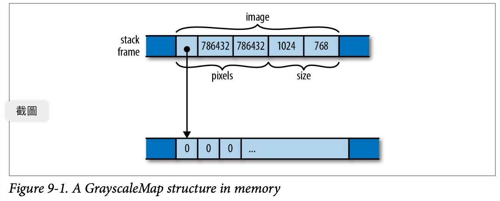

# Structs

Rust結構，有時稱為結構，類似於C和C++中的結構類型、Python中的類和JavaScript中的對象。 結構將各種類型的多個值組合成一個值，囙此可以將它們作為一個單元進行處理。 給定一個結構，您可以讀取和修改它的各個組件。 結構可以具有與其關聯的方法，這些方法對其組件進行操作。


Rust有三種`結構類型named-field`，`命名欄位類元組 tuple-like` 和`類單元unit-like`，它們在引用組件的管道上有所不同：命名欄位結構為每個組件提供名稱，而類元組結構則根據它們的出現順序來識別它們。 單元式結構根本沒有組件； 這些並不常見，但比你想像的更有用。


## Named -Field Structs 

The definition of a named-field struct type looks like this:

```rust
//a rectangle of eight-bit grayscale pixels
struct GrayscaleMap{
  pixels: Vec<u8>,
  size:  (usize,usize)
}
```

This declares a type GrayscaleMap with two fields named pixels and size, of the given types. 

Rust中的約定是，所有類型（包括結構）的名稱都要大寫每個單詞的第一個字母，比如GrayscaleMap，一種稱為CamelCase的約定。 欄位和方法是小寫的，單詞用底線分隔。
這被稱為snake_case

You can construct a value of this type with a struct expression, like this:

> named-field.rs


結構運算式以類型名稱（GrayscaleMap）開頭，並列出名稱和
每個欄位的值，全部用大括弧括起來。 還有填充的簡寫
來自局部變數或具有相同名稱的參數的欄位：


與所有其他項一樣**，structs默認情况下是私有的，僅在模塊中可見，**其中
他們被宣佈了。 您可以通過在結構的定義前加首碼，使其在模塊外可見

`GrayscaleMap` 它的每個欄位也是如此，默認情况下這些欄位也是私有的：

```rust
//a rectangle of eight-bit grayscale pixels
pub struct GrayscaleMap{
    pub pixels: Vec<u8>,
    pub size:  (usize,usize)
}

```


Even if a struct is declared pub, its fields can be private:

```rust
//a rectangle of eight-bit grayscale pixels
pub struct GrayscaleMap{
    pixels: Vec<u8>,
    size:  (usize,usize)
}

```

其他模塊可以使用此結構及其可能具有的任何公共方法，但不能
按名稱訪問專用欄位，或使用結構運算式創建新欄位
GrayscaleMap值。 也就是說，創建結構值需要結構的所有欄位
可見。 這就是為什麼不能編寫結構運算式來創建新的String或
Vec。 這些標準類型是結構，但它們的所有欄位都是私有的。 為了創建一個，
您必須使用像Vec::new（）這樣的公共方法。


創建命名欄位結構值時，可以使用相同的另一個結構
鍵入為您忽略的欄位提供值。 在結構運算式中，如果命名欄位
後面跟著`.. EXPR`則任何未提及的欄位從EXPR取其值，
其必須是相同結構類型的另一個值。 假設我們有一個結構repre‐
在遊戲中扮演怪物：

>  named-field.rs


對於程式師來說，最好的童話故事是《魔法學徒》：一個新手魔術師
附魔掃帚為他工作，但不知道如何在
工作完成了。 用斧頭把掃帚砍成兩半只會產生兩把掃帚
一半的大小，但以與原作相同的盲目奉獻繼續執行任務：


## tuple-like structs

第二種結構類型被稱為類元組結構，因為它類似於元組：

```rust
struct Bounds(usize,usize)
```

構造這種類型的值就像構造元組一樣，只是必須包含結構名稱：

```rust
let image_bounds = Bounds(1024,768);
```

在元組結構中的數值可以叫做元素element，就像元組一樣

```rust
assert_eq!(image_bounds.0*image_bounds.1,786432);
```

類元組結構的單個元素可能是公共的，也可能不是：

```rust
pub struct Bounds(pub usize,pub usize);
```

運算式Bounds（1024768）看起來像一個函數調用，事實上它是：定義類型也隱式定義了一個函數：

```rust
fn Bounds(elem0:usize,elem1:usize)->Bounds{...}
```

在最基本的層次上，命名欄位和類元組結構非常相似。 選擇使用哪一個可以歸結為易讀性、歧義性和簡潔性的問題。 如果您將使用。 運算子來獲取值的組成部分，按名稱識別欄位可以為讀者提供更多資訊，而且可能更能防止拼寫錯誤。 如果您通常使用模式匹配來查找元素，那麼類似元組的結構可以很好地工作。


簇狀結構適用於新類型，即具有單個組件的結構，您可以定義該組件以進行更嚴格的類型檢查。 例如，如果您使用的是僅ASCII文字，則可以定義一個新類型，如下所示：

```rust
struct Ascii(Vec<u8>);
```

對ASCII字串使用這種類型比簡單地傳遞`Vec<u8>`緩衝區並在注釋中解釋它們要好得多。 newtype有助於Rust捕捉其他位元組緩衝區傳遞給期望ASCII文字的函數的錯誤。 我們將在第21章中給出一個使用newtype進行有效類型轉換的例子。

## Unit-Like Structs

第三種結構有點晦澀：它聲明了一個根本沒有元素的結構類型：

```rust
struct Onesuch;
```

這種類型的值不佔用記憶體，很像`type()`。 Rust實際上並不需要將類似單元的結構值存儲在記憶體中，也不需要生成程式碼來操作它們，因為它可以僅從值的類型中告訴它可能需要瞭解的關於值的一切。 但從邏輯上講，空結構是一種與其他類型一樣具有值的類型，或者更準確地說，是一種只有一個值的類型：
` let o=Onesuch;`

Unit-like structs can also be useful when working with traits, which we’ll describe in chapter11 


## Struct Layout

在記憶體中，命名欄位和類元組結構都是相同的：可能是混合類型的值的集合，在記憶體中以特定的管道排列。 例如，在本章的前面，我們定義了這個結構：


```rust
struct GrayscaleMap{
  pixels:Vec<u8>,
  size:(usize,usize)
}
```

A GrayscaleMap value is laid out in memory as diagrammed in Figure 9-1.




與C和C++不同，Rust沒有具體承諾如何在記憶體中對結構的欄位或元素進行排序； 這張圖只顯示了一種可能的排列方式。 然而，Rust確實承諾將欄位的值直接存儲在結構的區塊中。 JavaScript、Python和Java會將點數和大小值分別放在各自的堆分配塊中，並讓GrayscaleMap的欄位指向它們，而Rust則將點數和尺寸直接嵌入GrayscaleMap值中。 只有點數向量所擁有的堆分配緩衝區保留在其自己的塊中。
您可以要求Rust使用#[repr（C）]内容以與C和C++相容的管道佈局結構。 我們將在第21章中對此進行詳細介紹。


## Definin Methods with impl

在整本書中，我們一直在對各種值調用方法。 我們已經用`v.push（e）`將元素推送到向量上，用`v.len（）`獲取它們的長度，用`r.expect（“msg”）`檢查Result值中的錯誤，等等。
您可以在定義的任何結構類型上定義方法。 Rust方法不是像C++或Java那樣出現在結構定義中，而是出現在一個單獨的impl塊中。 例如

> impl.rs


## Generic Structs


## Structs with Lifetime Parameters


## Deriving Common Traits for Struct Types


## Interior Mutability

